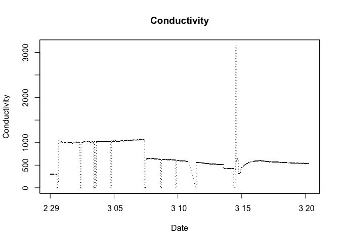
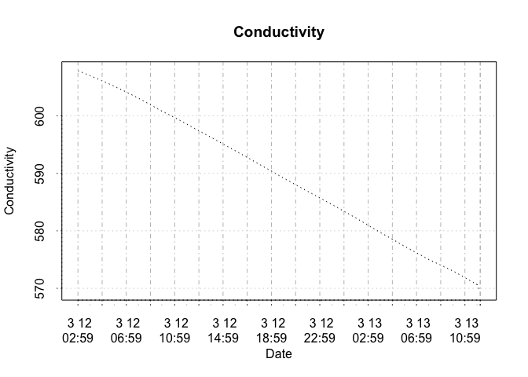

Untitled
================

GitHub Documents
----------------

This is an R Markdown format used for publishing markdown documents to GitHub. When you click the **Knit** button all R code chunks are run and a markdown file (.md) suitable for publishing to GitHub is generated.

探索性分析
----------

``` r
mydata <- read.csv(url("https://raw.githubusercontent.com/danalysis/modern-agriculture/master/data/data.csv"), header = TRUE, stringsAsFactors = FALSE)
tdata <- mydata
```

Representing Time Series Data
-----------------------------

删除重复数据

``` r
tdata <- tdata[!duplicated(tdata$Time),]
```

表示成时间序列数据

    ## Warning: package 'zoo' was built under R version 3.2.5

    ## 
    ## Attaching package: 'zoo'

    ## The following objects are masked from 'package:base':
    ## 
    ##     as.Date, as.Date.numeric

计算每天的平均值

``` r
library(xts)
ts.daily <- apply.daily(as.xts(ts), mean)
ts.wt.daily <- apply.daily(as.xts(ts.wt), mean)
ts.ah.daily <- apply.daily(as.xts(ts.ah), mean)
ts.tp.daily <- apply.daily(as.xts(ts.tp), mean)
ts.tl.daily <- apply.daily(as.xts(ts.tl), mean)
ts.co.daily <- apply.daily(as.xts(ts.co), mean)
ts.nl.daily <- apply.daily(as.xts(ts.nl), mean)
```

<!-- --><!-- --><!-- --><!-- --><!-- --><!-- -->

分析 2016-03-07 10:41:00 ~ 2016-03-13 12:15:00 的数据
-----------------------------------------------------

观察到 2016-03-07 10:41:00 到 2016-03-07 10:41:00 这一时间段中，液面高度和导电度都有下降的趋势，而这一时间段前后液面高度和导电率都有明显的上升，猜测在这一时间的段之前和之后都有向水箱中添加清水和营养液，而在这一时间段并没有向水箱中添加任何物质。我们假设这一猜测成立，那么在这一时间段里，液面和电导率的变化是由于植物吸收引起的。因此下面将集中分析大约这一周时间的数据。

``` r
# 1. Boxplot and Histogram of Tank Level
#par(mfrow=c(2,2))

#tl <- coredata(ts.tl)
#hist(tl, main = "Histogram of Tank.Level", xlab = "Tank Level")
#boxplot(tl, main = "Boxplot of Tank.Level", xlab = "Tank Level")

# 2. delete out value
#repeat {
#  outvalue <- boxplot.stats(tl)$out
#  tl[tl %in% outvalue ] <- NA
  
#  if (length(outvalue) == 0) break
#}

#hist(tl, main = "Histogram of Tank.Level", xlab = "Tank Level")
#boxplot(tl, main = "Boxplot of Tank.Level", xlab = "Tank Level")

#par(mfrow=c(1,1))

# 3. focus on the middle section data ###

lo <- 10079
hi <- 17855
heightBox <- 17

ts.mid <- ts[lo:hi]
```

### 每小时平均水位高度 2016-03-07 10:41:00 ~ 2016-03-13 12:15:00

``` r
tl <- ts.tl[lo:hi]

ts.tl.mid <- zoo(heightBox - coredata(tl), index(tl))

plot(ts.tl.mid, lty = "dotted" , main = "Tank Level", xlab = "Date", ylab = "Tank Level", ylim = range(coredata(ts.tl.mid)))
```

<!-- -->

``` r
X2 <- as.xts(ts.tl.mid)
ts.tl.mid.hourly <- period.apply(X2, endpoints(X2, "hours"), mean)

plot(ts.tl.mid.hourly, lty = "dotted" , main = "Tank Level", xlab = "Date", ylab = "Tank Level", ylim = range(coredata(ts.tl.mid.hourly)))
```

<!-- -->

``` r
m <- lm(coredata(ts.tl.mid.hourly) ~ index(ts.tl.mid.hourly))
detr <- zoo(resid(m), index(ts.tl.mid.hourly))
plot(detr)
```

<!-- -->

``` r
summary(detr)
```

    ##      Index                          detr          
    ##  Min.   :2016-03-07 10:59:00   Min.   :-1.001833  
    ##  1st Qu.:2016-03-08 20:14:00   1st Qu.:-0.384420  
    ##  Median :2016-03-10 05:29:00   Median :-0.009616  
    ##  Mean   :2016-03-10 10:31:01   Mean   : 0.000000  
    ##  3rd Qu.:2016-03-12 03:44:00   3rd Qu.: 0.379622  
    ##  Max.   :2016-03-13 12:15:00   Max.   : 1.504794

``` r
ts.tl.mid.hourly.ma <- rollmean(ts.tl.mid.hourly, 100, align="right")

plot(ts.tl.mid.hourly.ma, lty = "dotted" , main = "Tank Level", xlab = "Date", ylab = "Tank Level", ylim = range(ts.tl.mid.hourly.ma))
```

<!-- -->

``` r
#library(KernSmooth)

#t <- index(ts.tl.mid.hourly)
#y <- as.vector(coredata(ts.tl.mid.hourly))

#gridsize <- length(y)
#bw <- dpill(t, y, gridsize=gridsize)
#lp <- locpoly(x=t, y=y, bandwidth=bw, gridsize=gridsize)
#smooth <- lp$y
```

``` r
ts.tl.mid.daily <- apply.daily(as.xts(ts.tl.mid), mean)

plot(ts.tl.mid.daily, lty = "dotted" , main = "Tank Level", xlab = "Date", ylab = "Tank Level", ylim = range(coredata(ts.tl.mid.daily)))
```

<!-- -->

### 每小时平均电导率 2016-03-07 10:41:00 ~ 2016-03-13 12:15:00

``` r
co <- ts.co[lo:hi]

ts.co.mid <- zoo(coredata(co), index(co))
plot(ts.co.mid, lty = "dotted" , main = "Conductivity", xlab = "Date", ylab = "Conductivity", ylim = range(coredata(ts.co.mid)))
```

<!-- -->

电导率的时间序列图中，有很多0 值，在进一步分析之前，将进行补插

``` r
co.core <- coredata(ts.co.mid)
co.core[co.core == 0] <- NA

tl.co <- data.frame(ts = coredata(ts.tl.mid), co.core)

library(mice)
```

    ## Loading required package: Rcpp

    ## mice 2.25 2015-11-09

``` r
imp <- mice(tl.co, seed=1234)
```

    ## 
    ##  iter imp variable
    ##   1   1  co.core
    ##   1   2  co.core
    ##   1   3  co.core
    ##   1   4  co.core
    ##   1   5  co.core
    ##   2   1  co.core
    ##   2   2  co.core
    ##   2   3  co.core
    ##   2   4  co.core
    ##   2   5  co.core
    ##   3   1  co.core
    ##   3   2  co.core
    ##   3   3  co.core
    ##   3   4  co.core
    ##   3   5  co.core
    ##   4   1  co.core
    ##   4   2  co.core
    ##   4   3  co.core
    ##   4   4  co.core
    ##   4   5  co.core
    ##   5   1  co.core
    ##   5   2  co.core
    ##   5   3  co.core
    ##   5   4  co.core
    ##   5   5  co.core

``` r
fit <- with(imp, lm(co.core ~ ts))
pooled <- pool(fit)
summary(pooled)
```

    ##                   est        se        t       df Pr(>|t|)     lo 95
    ## (Intercept) 434.54005 1.3108197 331.5025 2612.876        0 431.96970
    ## ts           17.90678 0.1499446 119.4226 2183.356        0  17.61273
    ##                 hi 95 nmis        fmi     lambda
    ## (Intercept) 437.11040   NA 0.03235492 0.03161453
    ## ts           18.20083    0 0.03691242 0.03603062

``` r
tl.co.complete <- complete(imp, action=3)

ts.co.mid <- zoo(tl.co.complete$co, index(co))

plot(ts.co.mid, lty = "dotted" , main = "Conductivity", xlab = "Date", ylab = "Conductivity", ylim = range(coredata(ts.co.mid)))
```

<!-- -->

``` r
X2 <- as.xts(ts.co.mid)
ts.co.mid.hourly <- period.apply(X2, endpoints(X2, "hours"), mean)

plot(ts.co.mid.hourly, lty = "dotted" , main = "Conductivity", xlab = "Date", ylab = "Conductivity", ylim = range(coredata(ts.co.mid.hourly)))
```

<!-- -->

``` r
m <- lm(coredata(ts.co.mid.hourly) ~ index(ts.co.mid.hourly))
detr <- zoo(resid(m), index(ts.co.mid.hourly))
plot(detr)
```

<!-- -->

``` r
summary(detr)
```

    ##      Index                          detr         
    ##  Min.   :2016-03-07 10:59:00   Min.   :-32.3847  
    ##  1st Qu.:2016-03-08 20:14:00   1st Qu.: -4.3403  
    ##  Median :2016-03-10 05:29:00   Median : -0.4821  
    ##  Mean   :2016-03-10 10:31:01   Mean   :  0.0000  
    ##  3rd Qu.:2016-03-12 03:44:00   3rd Qu.:  5.5248  
    ##  Max.   :2016-03-13 12:15:00   Max.   : 15.8952

``` r
ts.co.mid.hourly.ma <- rollmean(ts.co.mid.hourly, 100, align="right")

plot(ts.co.mid.hourly.ma, lty = "dotted" , main = "Conductivity", xlab = "Date", ylab = "Conductivity", ylim = range(coredata(ts.co.mid.hourly.ma)))
```

<!-- -->

``` r
ts.co.mid.daily <- apply.daily(as.xts(ts.co.mid), mean)

plot(ts.co.mid.daily, lty = "dotted" , main = "Conductivity", xlab = "Date", ylab = "Conductivity", ylim = range(coredata(ts.co.mid.daily)))
```

<!-- -->

### 计算小时产量

``` r
ts.tl.co.hourly <- zoo(coredata(ts.tl.mid.hourly.ma) * coredata(ts.co.mid.hourly.ma), index(ts.tl.mid.hourly.ma))

plot(ts.tl.co.hourly, lty = "dotted" , main ="TankLevel * Conductivity", xlab = "Date", ylab = "TankLevel * Conductivity", ylim = range(coredata(ts.tl.co.hourly)))
```

<!-- -->

``` r
-diff(ts.tl.co.hourly)
```

    ##                             
    ## 2016-03-12 03:59:00 32.92610
    ## 2016-03-12 04:59:00 33.02515
    ## 2016-03-12 05:59:00 36.67022
    ## 2016-03-12 06:59:00 44.53999
    ## 2016-03-12 07:59:00 44.10715
    ## 2016-03-12 08:59:00 43.38157
    ## 2016-03-12 09:55:00 34.55077
    ## 2016-03-12 10:59:00 34.34558
    ## 2016-03-12 11:59:00 37.61432
    ## 2016-03-12 12:59:00 39.48696
    ## 2016-03-12 13:59:00 32.19226
    ## 2016-03-12 14:59:00 31.29643
    ## 2016-03-12 15:59:00 39.68928
    ## 2016-03-12 16:59:00 41.08840
    ## 2016-03-12 17:59:00 34.66368
    ## 2016-03-12 18:59:00 34.84192
    ## 2016-03-12 19:59:00 33.15618
    ## 2016-03-12 20:59:00 31.63888
    ## 2016-03-12 21:59:00 29.78912
    ## 2016-03-12 22:59:00 30.20409
    ## 2016-03-12 23:59:00 36.60149
    ## 2016-03-13 00:59:00 36.10897
    ## 2016-03-13 01:59:00 34.38666
    ## 2016-03-13 02:59:00 39.41574
    ## 2016-03-13 03:59:00 40.06734
    ## 2016-03-13 04:59:00 31.26373
    ## 2016-03-13 05:59:00 37.37204
    ## 2016-03-13 06:59:00 35.27525
    ## 2016-03-13 07:59:00 35.98195
    ## 2016-03-13 08:59:00 28.20475
    ## 2016-03-13 09:59:00 26.46528
    ## 2016-03-13 10:59:00 38.96724
    ## 2016-03-13 11:59:00 36.35646
    ## 2016-03-13 12:15:00 40.80105

### 计算其他因子每小时平均值

水温
